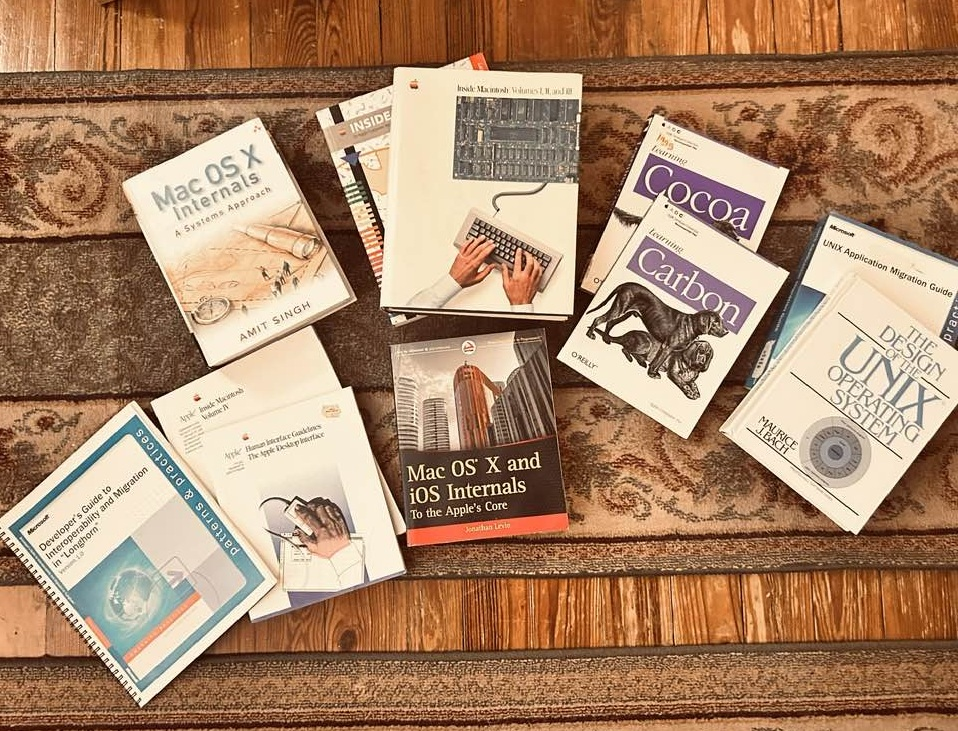
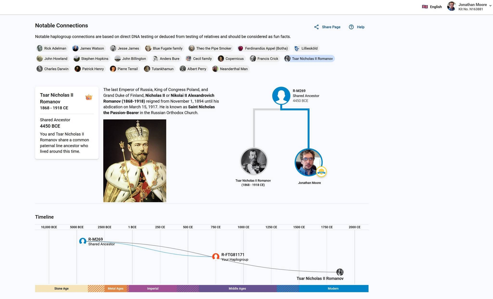
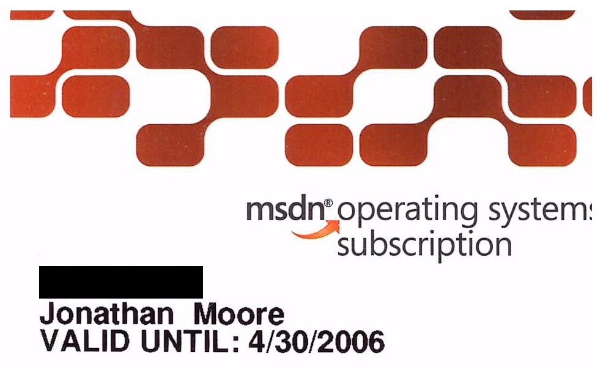
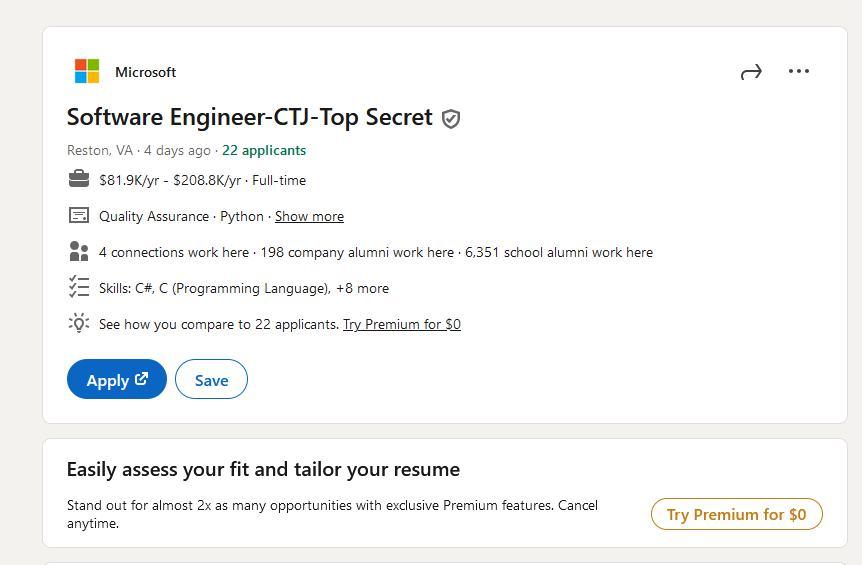


<!---->

  
<h2>Jonathan Romanov Moore FRSA </h2>
<p>jonathanmoore@computer.org | jonathanmoore@sphinxlogic.onmicrosoft.com | https://sphinxlogic.visualstudio.com | Reston, Va, US <p></p>

* [Microsoft Employee Login](https://docs.microsoft.com/en-us/dynamics/s-e/howto)

* [Build Lab for Microsoft Employees and Partners](https://betawiki.net/wiki/Build_lab)

* [Charles Babbage Throws a Party](https://medium.com/@michaelswaine/charles-babbage-throws-a-party-e6abcef8fef1)

* [Moore No. 1 Family pedigree](https://www.libraryireland.com/Pedigrees1/Moore1Ir.php)

* [Jonathan Romanov Moore's Personality](https://www.youtube.com/watch?app=desktop&v=pQyLjLqFNWY)

* [Jonathan's Macromedia Stock Merger](./Market/Macromedia/a2161099zf1_424b3.pdf)

* [Liqudity Value](https://www.lawinsider.com/dictionary/liquidity-value)

* [Oracle](https://github.com/oracle)

* [Larry Ellison’s Masterpiece: Microsoft Becomes Oracle’s Largest Customer](https://cloudwars.com/cloud/larry-ellisons-masterpiece-microsoft-becomes-oracles-largest-customer-2/)

* [The Rise and Fall of the Gold Standard in the United States](https://www.hillsdale.edu/educational-outreach/free-market-forum/2012-archive/the-rise-and-fall-of-the-gold-standard-in-the-united-states/)

* [Inifinity](https://plato.stanford.edu/entries/infinity/)

* [Cultural Capital and U.S. Education](https://www.ebsco.com/research-starters/education/cultural-capital-and-us-education)

* [The US Consistution](https://constitutioncenter.org/the-constitution)

* [Why a high IQ doesn't mean you're smart](https://som.yale.edu/news/2009/11/why-high-iq-doesnt-mean-youre-smart)

* [Why Do Fortune 500 Companies Still Use Legacy Systems?](https://www.redpilllabs.com/blog/why-do-fortune-500-companies-still-use-legacy-systems)

* [My Clio Award Confirmation Letter](./Clios/1441.pdf)

<!--<p><a href="https://pro.imdb.com/name/nm16454040?ref_=wa_nv_pro">Jonathan Moore's IMDB Pro</a></p>

<p><a href="https://www.bitsavers.org/pdf/dec/">VAX VMS Software</a></p>

<p><a href="https://www.psychologytoday.com/us/blog/biocentrism/201112/does-the-soul-exist-evidence-says-yes?msockid=312bc345a4a06dbc26e6d530a50e6c4c">Does the Soul Exist? Evidence Says ‘Yes’</a></p>

<p><a href="https://plato.stanford.edu/entries/moore-moral/">Moore’s Moral Philosophy</a></p>

<p><a href="https://geoffreyamoore.com/book/the-infinite-staircase/">The Infinite Staircase</a></p>

<p><a href="https://moen.nidec.com/fr-CH/drives/News-And-Media/Blog/Insights/Articles/2017/03/22/Calculating-Infinity-The-Paradox-Of-Moores-Law">Calculating infinity: the paradox of moore's law</a></p>

<p><a href="https://drmichaelwayne.com/blog/more-and-moore-the-binary-mind-goes-quantum/">More and Moore: The Binary Mind Goes Quantum</a></p>

<p><a href="https://news.microsoft.com/source/2000/10/02/corel-and-microsoft-announce-strategic-alliance/">Corel and Microsoft Announce Strategic Alliance</a></p>

<p><a href="https://www.msn.com/en-us/money/markets/it-s-time-for-a-microsoft-reset-here-s-what-investors-should-focus-on-now/ar-AA21X2Ey">It’s time for a Microsoft reset. Here’s what investors should focus on now</a></p>

<a href="https://www.vanityfair.com/style/2015/07/queen-elizabeth-corgis-a-history">The Queen and Her Corgis</a></p>

<p><a href="https://answersingenesis.org/charles-darwin/was-charles-darwin-a-christian">Was Charles Darwin a Christian?</a></p>

<p><a href="https://academic.oup.com/gbe/article/8/3/607/2574116">Evolutionary Relationships among Extinct and Extant Sloths: The Evidence of Mitogenomes and Retroviruses Because Sloths Do Not Have Last Names</a></p>

<p><a href="https://www.lawinsider.com/dictionary/liquidity-value">Liquidity Value</a></p>

<p><a href="https://www.mirrorservice.org/">Kent Mirror Service</a></p>

<p><a href="https://windowsdevops.github.io/">Windows Devops</a></p>

<p><a href="https://sdtimes.com/cia/sd-times-blog-cia-can-teach-development/">What the CIA can teach you about development</a></p>

<ul>
  <li>GNU Dev mailing list</li>
  <li>Apple Kernel Dev Mailing list</li>
  <li>Sourceware Embedded C ++ Mailing list</li>  
</ul>-->


<!--<h2>PROFESSIONAL SUMMARY</h2>

<p>I'm using Family Tree DNA. I tested as a INTJ-T like Dr. Steven Hawking as a INTJ. I'm a Royal Society of the Arts Fellow. My grandmother Helen Mcnutt taught me about oil crisis in 1980's. My mother Charlene Chatman bought me my first PC and Tandy computer which originally sold leather. I went to Hollins Communication and was diagnosed with a lateral excision lisp and helped the actress Emily Blunt with her computer in 1989. I worked on Steven Spielberg's movie Artificial Intelligence Macromedia Flash Website, help ship Macromedia Studio 8 with a Macromedia patent portfolio. My first investment was at Moors and Cabot and Anne Hathaway the actress is my first soulmate. I licensed QuickTime source code in 2001 from Apple Computer. I own $2 million in housing vouchers from a Charlton Sheets program. I'm a retired Microsoft Gold Partner and worked on Microsoft MAUI in college in 2009 where.

I was featured in US and world report as a 30 under 30 millionaire with Edward Jones on admissions to UVa-Wise in the Founders Society now with a UVa Computer Science Degree and 25 years in the computer industry. Straight A college graduate with a Scholar Award and Microsoft SQL Server Sales Award. I'm also a Microsoft MVP. With lifetime affiliate TrainSec Microsoft Windows Internals Certification. Made a Human Genome Database in college from esembl text files.
I have $73 million in cash for my wedding as a asset type. I'm a direct decedent of the famed The last Emperor of Russia Nicolas the II, Charles Darwin, Jimmy Buffet, Nicolaus Copernicus, the Today Show's Ann Curry, Francis Crick, Pepin the Short and Jesse James and the less educated Curtis Hathaway, Patricia Underwood, Donny Rose, Kristen Hamilton, Morgan Gates, Ann Turner, Ruthie McCulley, Harold Stoker, Jay Mueller, Melanie Boyle, Patricia York, Steve McCready, Robert Shelley. Bill Gates taught me not to let your company drown in cash and lets keep it that way. I was born on April 24th 1978. Microsoft Windows Server 2003 was released on my birthday.

Looking forward to a Adobe sponsored Sun Microsystems Grant and spending time with my father the Builders First Source retired executive David Moore. I've been a Microsoft Knowledge worker for 25 years collecting source code and building Operating Systems. I had a MSDN Help technical case in 2003 to put the MSDN Library online. I would have you in Operating Systems Theory if it wasn't for Facebook in 2004. My family drafted a irrevocable trust in 2019.
Finally Me, Jonathan David Allen Moore discovered the American Type Culture Collection website in 2001 and used Internet Explorer as a IE favorite for Immortalized Cell Lines

Written and copyright by Jonathan Moore 2026

<h3>Events</h3>
<ul>
<li>The first BSD was released in January 1978 when my family was moving to TN/VA from Atlanta, Ga and a tornado struck Bristol, TN,VA</li>
<li>I traveled to the Washington, DC and set in on the 99th session of Congress in 1987 and met Al Gore</li>
<li>At SGI Inc. there is a specific historical link between Silicon Graphics Inc. (SGI) and US military operations involving Afghanistan in the search for Osama Bin Laden.</li>
</ul>

<p>When Microsoft released the first version of Windows NT in April 1993, the company’s marketing and public relations campaign heavily emphasized the NT (i.e., New Technology) in the operating system’s (OS’s) name. Microsoft promoted NT as a cutting-edge OS that included all the features users expected in an OS for workstations and small to midsized servers. Although NT was a new OS in 1993, with a new API (i.e., Win32) and new user and systems-management tools, the roots of NT’s core architecture and implementation extend back to the mid-1970s.

And now… The rest of the story: I’ll take you on a short tour of NT’s lineage, which leads back to Digital and its VMS OS. Most of NT’s lead developers, including VMS’s chief architect, came from Digital, and their background heavily influenced NT’s development. After I talk about NT’s roots, I’ll discuss the more-than-coincidental similarities between NT and VMS, and how Digital reacted to NT’s release.</p>

<ul>
<li>Mathworks Matlab</li>
<li>Propellerhead Reason</li>
<li>Native Instruments Komplete Ultimate</li>
<li>Cycling 74' Max</li>
<li>Ableton Live Suite</li>
<li>Coral Suite</li>
<li>Adobe CS2, CS6</li>
</ul>

<ul>
<li>Building a DAW with Planet CCARMA from Stanford University</li>
</ul>

<h2>CAREER HISTORY</h2>

<h2>The following is CD/DVD date stamped</h2>

<h3>Counsel Of Foreign Relations</h3>

2026-present

Chair inherited a 1800's Shakespeare Collection from London, UK raised on Macmillian and Oxford Environmental History, David Attenbough, Daniel Quinn Novels and support the Story of B., Darwin, Dr. Who not Disney and studying the World Federation of Exchanges Markets and Banking Laws all 200 Volumes. Cached the Security and Exchange Commision EDGER in the USA. My family have always paid our taxes dating back to William the Conquer and the Doomsday book. I'm also related to Pepin the Short the Father of King Charlemagne. My father stopped my from hanging around the wrong crowd in 1997 and I bought and promoted <b>Urge Overkill's 'Exit the Dragon'</b> Gave blood at Southwest Virginia Mental Health Institute in 2001 to the <b>American Type Culture Research Program</b>. For Immortalized Cell Lines. I also licencesd Quicktime and NeXtStep Source Code from Apple Computer in 2001. Gave <b>Microsoft IconFX</b> in a Knownlege work report. I bought and promoted <b>Pearl Jam's Backspacer and Urge Overkill's 'Rock & Roll Submarine'</b> in 2011. Sold Adobe and Microsoft Stock in 2017, bought and promoted James Blunt's Afterlove. Bought and promoted Digital Storm PC's in 2025. Hoping for a Microsoft Acquisition. In 2025 I invested in Standard Oil, Nintendo, Square Enix and Unysis the first open source software company the former Burrough's Company. My assets are frozen and these stocks are a hold indefinitely.

<p>My DNA Match is Anne Hathaway the Actress. I know this from paying $1k in DNA Testing. I took Advanced Placement Biology in High School a College Course.</p>

<p>I tested as a INTJ-T at the University of California Fulerton found in only about 1.9% of the global population and have the same personality and Dr. Steven Hawking. Bought a Harvard University Press book on how to fund a bank. In 2025 with Anne Hathaway the actress.<p><a href="https://vero.co/">I'm Verified on Vero</a></p> the Anti-Facebook. Finishing a 2003 Microsoft help case of turning HXS files into online documentation project scope may still be too large. Finishing my BYO Computer Science and Information Technology Code Center Premium from the years 1968 to Present. With my B in Information Security, A in Psychology, A in Sociology. I believe ethical hacking of Igor Sakhnov of Microsoft is just and not wasting your life programming the debug help just signing Microsoft's Master Source Code Agreement. The university graduation rule and public education law is 8 complete semesters. On the waiting list at New Beginnings in Santa Barbra, California. With $5 million in housing vouchers. Researching why INTJ's don't like ordinary people. </p>-->

<!--<h3>Microsoft Imagine Cup </h3>

2025

Won my Microsoft MVP for my Microsoft Windows Build Instructions for the 2003 System Intergrator Shared Source Contract in 2003

<h2>Royal Society of the Arts Fellowship</h2>

<p><a href="https://www.jstor.org/journal/rsaj">RSA Journal</a></p>

2018 - present

Royal Charter The RSA is established by Royal Charter as its formation pre-dated the establishment of modern company law. A Royal Charter establishes a collection of individuals as a single legal entity – predating more modern legal ways to do this, such as companies and corporations. We continue to maintain a connection with the Royal Household; our Patron is the Princess Royal. The RSA’s charitable purposes are enshrined within its Royal Charter. Our Royal Charter was last updated in 2025. Our current charitable purposes are: ‘The encouragement of the Arts Manufactures and Commerce… . advancement of education in and the encouragement and conduct of research into the sustainable context within which the said Arts Manufactures and Commerce may prosper and be managed efficiently including research on al Commerce Design Industry Public Services Science Technology Social Enterprises Voluntary and other Arts to make both such research findings available to the public as wel as al other exclusively charitable purposes’ RSA Royal Charter RSA Supplementary Royal Charter Fellows’ Charter The RSA is a membership organisation whose members (Fellows) make a charitable subscription which contributes to the charitable work of the RSA (unless waived). All Fellows are expected to follow the RSA Fellows Charter and the code of conduct as part of their commitment. RSA Fellows’ Charter RSA Code of Conduct Bye-laws Additionally, the RSA is governed by agreed bye-laws amendments to which are approved by the Trustee Board and voted on by its members (Fellows)

<h2>Merrill</h2>

1998 - Present

Mom said IQ was around 120 to 140 tested in Atlanta, Ga and tested as a INTJ-T at 16 Personalities DOI: 10.34218/IJM.11.9.2020.025. NERIS Type Explorer® Scale. That same as Dr. Steven Hawking. Applied for the Genius Act in the United States. Investing in Unisys, HPE, Meta, Alphabet, Microsoft, Adobe, Nintendo, Square Enix, Kasha Saudi Arabia Oil and a Nationwide Mutual Fund. Anne Hathaway the actress and me share the same HLA System or are a DNA Match according to National Geographic and Family Tree DNA transfer. Also share 8 alignments for a healthy relationship. We share three surnames. Was given $99k by Anne Hathaway the Actress in to my account. We've worked it out. Paid her back $21K for a FBI Movie and paid off $5K of our debt.

<h2>Microsoft</h2>

Gold Partner  · 2003 - Present  · Redmond, Washington

<p>Endorsed by Microsoft Made a System Integrator Website for Microsoft Windows. Built MS-DOS 1.22 with Build Disk with MKS Toolkit, in Virtual Box with Device Guard Readiness on Windows 11 2024 IoT Enterprise LTSC. Microsoft Windows 2.11 with OEM Adaptation Kit, RSM-11M, PDP-11 through PDP-11 70, OS/2, VMS, POSIX, Project MICA, Visual Studio 6.0 Enterprise. Visual Studio.NET, UNIX Migration Guide. Shared Source Licensee, Microsoft Windows NT 4.0 , 2000, XP, 2003, XP, 2009 Embedded w/ Windows Automotive, CE 3.0-2013 with Preinstallation Environment 1.0, Interix with Santa Cruz Operation Source Code.</p>

<p>Longhorn Migration Guide using build 4074, Source Server Virtual Appliances. Won Microsoft SQL Server Sales award and have yet to collect sales revenue. Submitted my Visual Style Sample and it shipped. Worked on Project MAUI in 2010. Worked on Windows 8 Storyboards and Codeplex and .NET 6.0 GA. Using Microsoft Windows Server Deployment Services as a Transport Server and a Vista DDK Windows Management Instrumentation Sample for Image Enumeration. To connect to a Microsoft Corporate Deployment Server. Also built the Powershell v7.0 With Visual Studio.NET Disclosures. Bought the Book Hard Drive: Bill Gates Birth of a Microsoft Empire and worked 20 years on a copy of Bill Gates Hard Drive. Now Using Microsoft Windows 11 IoT Enterprise 2024 LTSC and Microsoft Office 2024 LTSC</p>

<h2>Oracle</h2>

Startup  · 2009 - Present  · Austin, Texas

Started with Oracle Linux 6.2 Worked with Netbeans 6.x, Developer Studio and Solaris 11.3 and 11.4 FOSS Program. Used GNU classpath, J2EE and .NET Framework and Java SE Editions with Windows Source Archive in the Linux Versions. I build Linux in Cygwin on Windows. and am a admin on the Sourceware Embedded C++ CVS list.

<h2>Ableton</h2>

Certifierd Trianer  · 2014 - 2020  · Berlin, Germany

I was endorsed by Ableton. Ran a Ableton User Group in the Tri-Cities TN,Va and use QT, Cycling '74 Max and JUCE to build Ableton Live and Max Devices. Use Pure Data and Java for jMax from IRCAM. Private GitHub repository access. Made five ambient albums and went #1 on the Ireland charts. Licensed the PX-18 Source Code. Licenced Reason Studios Source Code. Making Vinyl in 2025-2026 at Discmakers. Vero is my music label. Was in Apple Music. All songs copyright Jonathan David Allen Moore BMI Verified by song vue..

<h2>Apple</h2>

Software Developer  · 2007 - 2026  · Cupertino, California
Start with the Bash shell and GNUStep, Project Builder and the Darwin SDK the project files-files. Licensed Quicktime Source Code. I work with GNOME, the Common Desktop Environment and Macports. I put my ambient Music in Apple Music.

<h2>Adobe</h2>

Non Employee Director  · 1999 - 2006  · San Francisco, California

<p>I was endorsed by Sun Microsystems and Macromedia. Worked on the movie Artificial Intelligence Website at Flash Kit at a started a local Macromedia User Group, Affiliate and earned $750K in shareholder's equity in a M&A from Macromedia to Adobe. Participated in Macromedia Philanthropy. Licensed Macromedia Flash & Shockwave Source Code and Patent Portfolio. Held Meetings at ETSU and TCAT. With A Sun Microsystems Grant I worked on Macromedia Breeze. Worked on the Movie Artificial Intelligence Website for Steven Spielberg in 2001.</p> 

<p>Using POSIX Berkeley toolchains like bmake and fmake bootstrapped to build FreeBSD and NetBSD on a 1996 IBM Aptiva, Mac Pro 2008 running Mac OS X Snow Leopard and Lion, HP Intel i7 12 Core for x86 and use Oracle Virtual Box to build UNIX-Like Appliances with the Common Desktop Environment without XQuartz with the Cairo Dock, Sourceware's Cygwin and Microsoft's and ECMA's Shared Source Common Language Infrastructure 1.0 For FreeBSD and Gyro Generics and now on a Mac Pro 2024 M3 ARM64 Platform 8 TB SSD. and a 2025 Windows 11 IoT LTSC Digital Storm PC. x2 20 TB SSD's 100 TB Orico In support until 2040. I use premade appliances from FreeBSD to be a committer. iPhone 14 Max in support until 2029 contract at Verizon. I build FreeBSD using bmake on macOS.</p>

<h2>Sears</h2>

Electronics Manager  · 1998 - 2007  · Bristol, Virginia

<h2>EDUCATION</h2>

<p>Udemy  2025-01-01 Corporate Cash Management and Estate Planning</p>
<p>Stanford Online Liqunia-Graduated 2017-01-01 Computer Science</p>
<p>University of Virginia College at Wise -Graduated 2013-01-01 Computer Science GPA 3.5 in 2025 ACM Vice President Wise, Va Chapter</p>
<p>Tennessee Board of Regents - Graduated 2000-01-01 Microcomputer Specialist GPA 4.0 Class Valaditorian</p>
<p>Bristol Virginia Public Schools-Graduated 1996-01-01 General Studies GPA 2.8 Secion-V First String Catcher for the Toronto Blu-Jays Farm Team at Avoca in Bristol, TN</p>
<p>Hollins Communications Sept 11th 1989-April 1990 Lateral Excision Lisp with Emily Blunt the Actress</p>
<p>St. Anne's Catholic School Graduate 1990</p>
<p>Sullins Academy 1984</p>

<h2>SOCITIES</h2>
<p>2026 Joined California State Fullerton Founders Society supporting the Myers Briggs</p>
<p>2026 Joined Oxford University Founders Society supporting the new social mobility now Count Moore [old new thing]</p>
<p>2025 Joined UVa's Wise Philathopic Society</p>

<h2>CERTIFICATIONS</h2>
<p>Windows 7 Internals</p>
<p>Lifetime Windows Internals Trainsec</p>

<h2>Promoter</h2>

<p>Morrell Music and Builders First Source Curtis Morrell, Kelly Curtis, and my father were promoter for 8 Pearl Jam shows. Including my graduation show in 2013.</p>

<h3>Guns N' Roses</h3>

<p>My Aunt McGuiness attended the 1988 Aerosmith show and brought back a autograph</p>
<ul>
<li><a href="https://www.setlist.fm/setlist/guns-n-roses/1991/the-ritz-new-york-ny-7bd57ad8.html">The Ritz, NYC (May 16, 1991)</a></li>
</ul>

<h3>Pearl Jam Ten Club 1991-2026</h3>

<ul>
<li><a href="https://www.setlist.fm/setlist/pearl-jam/1998/thompson-boling-arena-knoxville-tn-63d61233.html">Thompson-Boling Arena - Knoxville, Tennssesse, Sept 06, 1998</a> [attended]</li>
<li><a href="https://www.setlist.fm/setlist/pearl-jam/2003/assembly-hall-champaign-il-1bd6217c.html">Assembly Hall, Champaign - IL - April 23rd 2003</a></li>
<li><a href="https://www.setlist.fm/setlist/pearl-jam/2009/wachovia-spectrum-philadelphia-pa-1bd7c9c0.html">Wachovia Spectrum - Philadelphia, PA, USA 2009</a></li>
<li><a href="https://www.setlist.fm/setlist/pearl-jam/2011/copps-coliseum-hamilton-on-canada-3d029df.html">Copps Coliseum - Hamilton, ON, Canada 2011</a></li>
<li><a href="https://www.setlist.fm/setlist/pearl-jam/2013/john-paul-jones-arena-charlottesville-va-3bc754f4.html">John Paul Jones Arena - Charlottesville, VA October 29th 2013</a></li>
<li><a href="https://www.setlist.fm/setlist/pearl-jam/2016/wells-fargo-center-philadelphia-pa-13f13119.html">Wells Fargo Center, Philadelphia, PA, USA North American Tour 2016</a></li>
<li><a href="https://www.setlist.fm/setlist/pearl-jam/2022/firstontario-centre-hamilton-on-canada-13b08999.html">FirstOntario Centre, Hamilton, ON, Canada 2022</a></li>
<li><a href="https://www.setlist.fm/setlist/pearl-jam/2025/lenovo-center-raleigh-nc-3b5fcc0c.html">Lenovo Center, Raleigh, NC, USA 2025</a></li>
</ul>

<p>Met Stone Gossard and Jeff Ament and played ping pong. Had a Press Pass 1998. Watched soundcheck asked to return to my seat at the end by a security guard with a firm tone and asked for my ticket. Taped the whole thing.</p>

<h2>Home Network</h2>

<p>Still Single, at 48; In 2024-2025 I began home networking again here is what I accomplished. 2 Computers on 2024 Mac Pro, One Elite Desk Hewlett Packard 2020 running Microsoft Windows 2019 Enterprise LTSC, LG Smart TV connected to a Comcast Enterprise Cable Modem. via Category 5 Ethernet cable. Sony PlayStation 5,  Microsoft Xbox X Series. Nintendo Switch and Switch 2. with about 30 games and 75 movies on Blu-ray. A 100 Terabyte Enclosure. with a Universal Sony Disc Player. The Consoles are connected to a HDMI Switch connected to the Klisph home theater. Biometic Fingerprint reader, and a Bluetooth Logi tech Webcam. LP Record Player. Kodak Pro Camera and JVC Video Capture Equipment and a Xerox Laser Jet Printer and USB Hub and peripherals. I'm connecting a Digital Storm Windows Server to the network in 2026. 100TB Orico Encousure to hot swap the drives. Final Cut Pro, Virtual Box, Coral Draw Suite with Licensed Macromedia Flash Source Code now in the Computer History Museum. Matlab 

I made my own personal Virtual Machine Cluster of Computer History Operating Systems from AT&T System V to Windows Server 2025 about 12 VM's with Source Code and Microsoft Code Center Premium.

I make UNIX-Like Operating Systems with the Common Desktop Environment and other Desktop Environments. VAX and Digital Corp Programming Environments from Bitsavers. OpenVMS for VAX source.  However I found it. Reading the Longhorn Migration Guide Build 4074 With new Longhorn reset layout and Vista XAML Windows with the WPF Toolkit Plus, MSDN Magazines Side Bar Source Code and the Longhorn Transformation pack, Reading Dissecting a C# Application and building SharpDevelop Wrox Edition, and using ILSpy and Global Assembly Cache decomplication of .NET Assemblies for my own Vista Transparency Center and reading the Windows Internals Supplement Series for next year’s Imagine Cup. Registered for 2026.

Made Windows NT 3.5/4.0/XP/2003 Source Code Build Server in a Windows XP 32-bit Virtual Box 1.5 Terabytes VHD with Longhorn PDC 2003 VHD mount and Microsoft MVP. Using Interix Services for UNIX, NetBSD 2.0, SCO, Solaris FOSS Program, Red Hat Linux 8.5 Source, AIX, AIX Toolbox, HP-UX and the Open-Source Tru-64 UNIX, OSF 1.0, Sourceware, and DECUS Windows XP OPK. OPK Training Courses the MSDN Library 2005 with UNIX Migration Guide, Windows XP UX Guidelines, Windows Research Kernel with Virtual Labs. Adobe CS2, ZAM3D, Swift 3D, Windows XP Embedded and Feature Pack. Microsoft Office XP Pro for PowerPoint. Visual C++ 4.2, 6.0, Visual Studio 2002, 2003, 2005 and Team Foundation Server 2005 for work groups Visual Studio 2008 Team System Oracle Tuxedo for middleware and 2010 Ultimate and the Shared Source Common Language Infrastructure. With Active State Perl 5.6 XP/2003 Platform SDK's and DDKs. Windows CE 6.0 with book and Training Courses. 

My 1983 Nintendo's back the NES and SNES Mini's with HDMI the N64 with SDK's and Operating Environments with Konami Code. Game Cube XENO Chip MOD with all the Game Cube ISO's with a SWISS  and a Mac G4 Cube PowerPC and XBox original Operating System source.

Nullsoft DJ Software, Cycling 74 Max with Planet CCARMA and a Ableton licensed PX-18 Source Code Gaming Console SDK's, Operating Systems and Development Kits. MSDN Subscription from 1999-2019. Recently bought Office 2024 LTSC, Visual Studio 2026 Enterprise. Windows 11 IoT 2024 Enterprise LTSC. Steinberg Cubase connected to 2 Yamaha Studio Monitors to a Creative Audigy Soudblaster. One Epiphone Les Paul Standard with Princeton Fender Amp and one AKAI 49 Key MIDI Controller and a Avid MBox Studio.

The software running are :

Cornell University's Bio HPC from Microsoft Research.

The price or cost is about $45K from Direct and Amazon.</p>

<!--<p>It is just your BYO Code Center Premium and a lot of Knowledge Work stay in school. Or you can go to a <a href="https://learn.microsoft.com/en-us/security/engineering/onlinesources">Microsoft Transparency Center</a> which I'm trying to make with the Windows Internals Supplement Series.</p>

<p>Liquidity Value means that amount which your Provider has determined is available to settle your Check transactions based on (i) the amount of cash in your Base Account, if any, (ii) the amount of money in the Deposit Accounts that are linked to your Base Account, (iii) the value of the Fund shares in your Base Account, and (iv) margin loans, but only to the extent of the available margin collateral value of securities in your Base Account as determined by your Provider. Your Provider may determine that the available margin collateral value for purposes of paying Check transactions is an amount less than that which could be used to purchase securities or otherwise be withdrawn from your Base Account. The available margin collateral value will fluctuate from day to day, since it depends upon securities prices and the debit balance in your Base Account, and your outstanding Check transactions received for processing. </p>-->

<!--ABOUT ME
<p>I have a driver’s license</p>
<p>I have a security clearance</p>

<p>Spoke with Microsoft Legal about indenity theft in my community and in Hollywood and the Virginia Joint Commission for discrimination and misdiagnosis, and missed opportunity at Stanford and Oxford University because of community service board employees in Virginia at Microsoft Legal. I've also spoke with Microsoft Legal about my normal contrast MRI and lawsuit against Morgan Maclure racing and SWVAMHI Dr. Barash. Never told Dr. Barash my grades and the game theory trick was played on me to agree to disagree. I have a lawsuit against Edward Jones for giving me a 1099-DIV and not a 1099-NEC in 2005.</p>

<p>Also housing discrimination against a Royal Society of the Arts lifetime fellow and career negligence on the part of the democratic party. I paid my tuition, I did not qualify for the Pell Grant my EFC was to high and my family pays its real estate taxes we expect the academic journals to be avaible to the homeowner. As much as we pay for internet service. Over $150 a month. I'm giving cash $3K to my father for a local lawyer's fee's soon he is about to go into a nursing home in five years or less. I'm inheriting one home and I rent. When I was furniture porter I paid for my families dinning room suit and living room. Now I rent and I've paid for everything in my apt. Including the den and bedroom suit and office equipment.</p>-->

<!--<p>Letters of recommendation from Microsoft Co-Founder Bill Gates, CEO Steve Ballmer and President Brack Obama.</p>

Copyright 2025 Monster.com and Career Builder.

<!--<h2>Links</h2>

<p><a href="https://psycnet.apa.org/record/2020-93235-006">Functional MRI findings in schizophrenia.</a></p>

<p><a href="https://www.forrester.com/blogs/determining-the-value-of-a-perpetual-license/">Determining the Value of a Perpetual License</a></p>

<p><a href="https://en.wikipedia.org/wiki/Moore_v._Regents_of_the_University_of_California">Moore v. Regents of the University of California</a></p>

<p><a href="https://archive.org/details/walnutcreekcdrom">Walnut Creek Collection</a><p>

<p><a href="https://ftp.zx.net.nz/pub/mirror/ftp.hp.com/">HP Freeware</a></p>

<p><a href="https://ftp.zx.net.nz/pub/mirror/sgi-freeware/">SGI IRIX Freeware</a></p>

<p><a href="https://www.microsoft.com/en-us/securityengineering/gsp?msockid=312bc345a4a06dbc26e6d530a50e6c4c">Government Security Program</a></p>

<p><a href="https://thirdpartysource.microsoft.com/">Third Party Disclosures</a></p>

<a href="https://dl.acm.org/doi/10.1145/2445196.2445344">Learning computer science in the "comfort zone of proximal development"</a>

<a href="https://www.forbes.com/sites/dbloom/2021/09/27/hollywood-edges-closer-to-strike-with-cinematographers-vote/">Hollywood Edges Closer To Strike With Cinematographers Vote</a>

<a href="https://channeldrive.in/cloud-computing/perficient-enables-azure-cloud-solutions-for-builders-firstsource/">Perficient Enables Azure Cloud Solutions for Builders FirstSource</a>

<a href="https://www.techpowerup.com/183152/digital-storm-ends-the-pre-built-vs-diy-debate-with-vanquish-line-of-gaming-pcs">Digital Storm Ends the Pre-Built vs. DIY Debate with VANQUISH Line of Gaming PCs</a>

<p><a href="https://docs.freebsd.org/en/books/handbook/cutting-edge/#building-on-non-freebsd-hosts">Building on Non FreeBSD</a></p>

<p><a href="https://blogs.microsoft.com/datalaw/initiative/legal-cases/microsofts-search-warrant-case/">Legal cases: Microsoft’s Search Warrant Case</a></p>

<p>The Windows Repository is here <a href="http://microsoft.visualstudio.com">http://microsoft.visualstudio.com</a> You need a Personal Access Token</p>
<p><a href="https://learn.microsoft.com/en-us/azure/devops/organizations/accounts/use-personal-access-tokens-to-authenticate?view=azure-devops&tabs=Windows">Personal Access Token</a></p>

<p><a href="https://learn.microsoft.com/en-us/entra/identity-platform/quickstart-create-new-tenant">Set up a new Microsoft Entra tenant</a></p>
<p><a href="https://github.com/windowsdevops">Windows DevOps</a></p>
<p><a href="https://github.com/icsharpcode/ilspy">ILSpy; Some Transparency</a></p>

<p><a href="https://www.newscientist.com/article/mg21829140-200-psychiatry-needs-its-higgs-boson-moment/">Psychiatry needs its higgs boson moment</a></p>

<p><a href="https://www.sciencedirect.com/science/article/pii/S0370269315001768">Stabilizing the Higgs potential with a Z′</a></p>-->

<!--<h2>Operating Systems and Games</h2>
<ul>
  <li><a href="https://archive.org/details/win-95-osr-2">Microsoft Windows 95</a></p></li>
  <li><a href="https://www.riscosopen.org/content/">RISC OS Open Limited the Nintendo 64 & Cube Operating System</a></p></li>
  <li><a href="https://ultra64.ca/resources/software/">Nintendo 64 SDK's</a></p></li>
  <li><a href="https://github.com/windowsdevops/Microsoft-Windows-NT-4.0-Source-Kit">Windows NT 4.0 Source KIt</a></p></li>
  <li><a href="https://github.com/windowsdevops/Microsoft-Windows-Server-2003-Source-Kit">Windows Server 2003 Source Kit</a></p></li>
  <li><a href="https://archive.org/download/GamecubeCollectionByGhostware">Nintendo Game Cube Games</a></p></li>
  <li><a href="https://www.gc-forever.com/wiki/index.php?title=Main_Page">Game Cube Forever Wiki</a></p></li>
  <li><a href="https://games.softpedia.com/get/Tools/Gamecube-ISO-Tool.shtml">Game Cube ISO Tool</a></p></li>
  <li><a href="https://github.com/windowsdevops/Microsoft-Windows-Vista-Buffer-Lab03_n">Microsoft-Windows-Vista-Buffer-Lab03_n</a></li>
</ul>

<ul>
<li><a target="_self" href="VMS_Language_and_Tools_Handbook_1985.pdf">VMS Language and Tools Handbook 1985</a></li>
<li><a target="_self" href="https://wiki.vmssoftware.com/Main_Page">VMS Software Wiki</a></li>
<li><a target="_self" href="https://www.sciencedirect.com/science/article/abs/pii/S0304405X16300472">Time is money: Rational life cycle inertia and the delegation of investment management</a>
</ul>

<p><a href="https://www.libraryireland.com/Pedigrees1/Moore1Ir.php">Moore No. 1 Family pedigree</a></p>

<p><a href="https://www.youtube.com/watch?app=desktop&v=pQyLjLqFNWY">Jonathan David Allen (Windsor) Moore's Personality</a></p>-->

### Articles

* [Articles](https://microsoft-os.github.io/docs/building/articles.html)
* [Awesome Repositories](https://github.com/pawelborkar/awesome-repos)

### Microsoft in Government

* [Project Maven](https://en.wikipedia.org/wiki/Project_Maven)

### Software
* [Computer History Source Code](https://computerhistory.org/playlists/source-code/)
* [Spin Operating System](http://www-spin.cs.washington.edu/)
* [UNIX Heritage Society](https://www.tuhs.org/)
* [UNIX Migration Strategy to Windows](https://www.cygwin.com/)
* [VAX VMS Software](https://www.bitsavers.org/pdf/dec/)
* [Wallnut Creek Collection](https://archive.org/details/walnutcreekcdrom)
* [Microsoft OpenJDK](https://www.microsoft.com/openjdk)
* [Maven Repository](https://repo.maven.apache.org/maven2/)
* [OpenVMS Archive](https://www.digiater.nl/)
* [SCO](http://www.sco.com/skunkware/)
* [Keybase](https://keybase.io/)
* [PTC MKSToolkit for DOS](https://winworldpc.com/product/mks-toolkit/41)
* [Windows RTM and Code Name Betas](https://archive.org/details/full-windows-archive)
* [Apple OSS Distributions](https://github.com/apple-oss-distributions)
* [Apple Internals](https://mroi.github.io/apple-internals/)
* [MacOS Forge](https://www.macosforge.org/)
* [Macports compile maintainers to win32, link in Portfile](https://github.com/macports/)
* [fsck.technology](https://fsck.technology/)
* [GNUStep](http://www.gnustep.org/)
* [Microsoft Acrchive](https://github.com/microsoftarchive)
* [Oracle Virtual Box](https://www.virtualbox.org/)
* [BeOS/Haiku](https://www.haiku-os.org/)
* [Adobe CS2](https://archive.org/details/Adobe-CS2)
* [Microsoft Expression Studio for XAML Export](https://archive.org/details/microsoft-expression-studio)
* [IBM SIMH PDF](https://github.com/jonathanromanvmoore/simh)
* [CMU's AI Repository](https://www.cs.cmu.edu/Groups/AI/0.html)

### Xeinx
* [Microsoft Xeinx](https://archive.org/details/TNM_Xenix_operating_system_-_SCO_20180304_0122/mode/1up)

### MSDOS
* [Microsoft Lisp for DOS](http://www.edm2.com/index.php/Microsoft_LISP) 
* [Microsoft Pascal](https://winworldpc.com/product/microsoft-pascal/40)
* [Microsoft Fortran for DOS](https://winworldpc.com/product/microsoft-fortran/5x)
* [MSDOS 3.0](https://archive.org/details/msexe)

### Microsoft Windows Builds
* [Windows 1.0](https://archive.org/details/windows-1-0)
* [Windows 2.03](https://archive.org/details/microsoft-windows-2.03-3.5)
* [Windows 3.1](https://archive.org/details/windows-3.1-beta-1-build-34f)
* [Windows NT 3.5](https://archive.org/details/3.51.896-multifre-client-workstation-retail-en-us.-7z)
* [Windows NT 4.0](https://archive.org/details/nt-4-4.00.1166.1)
* [Windows 95](https://archive.org/details/microsoftwindowsdetroitbuild1009-1216collection16files)
* [Windows 98](https://archive.org/details/microsoftwindowsmemphisbuild1351-1998collection73files)
* [Windows Whistler](https://archive.org/details/windows-whistler-collection)
* [Windows Longhorn Build 4084](https://archive.org/details/windows-longhorn-build-4084)
* [Windows Longhorn/Vista](https://archive.org/details/thelonghornarchive)
* [Windows Longhorn Server](https://archive.org/details/os-microsoft-windows-longhorn-server)
* [Windows 7](https://archive.org/details/Microsoft-Windows-7-Build-Collection)
* [Windows 8](https://archive.org/details/os-microsoft-windows-8)
* [Windows 8.1](https://archive.org/details/os-microsoft-windows-8.1)
* [Windows 10](https://archive.org/details/10.0.10014.0.winmain-prs.-150205-1859-amd-64fre-client-professional-retail-en-us) 
* [Boot Windows Pre-Installation Environment](https://docs.microsoft.com/en-us/windows-hardware/manufacture/desktop/boot-to-winpe?view=windows-10)
* [Features On Demand](https://docs.microsoft.com/en-us/windows-hardware/manufacture/desktop/features-on-demand-v2--capabilities?view=windows-11)
* [Windows Volume Activation](https://docs.microsoft.com/en-us/previous-versions/windows/it-pro/windows-server-2012-r2-and-2012/dn502540(v=ws.11))
* [Unsupported WDK versions](https://learn.microsoft.com/en-us/windows-hardware/drivers/legacy-wdk-downloads)
* [Windows SDK Archive](https://learn.microsoft.com/en-us/windows/apps/windows-sdk/downloads-archive)
* [Windows ADK Downloads](https://learn.microsoft.com/en-us/windows-hardware/get-started/adk-install#other-adk-downloads)
* [Microsoft Shared Source Iniaitive](https://microsoft-os.github.io/docs/building/priemium/Shared%20Source%20Initiative%20_%20Debugging.htm)
* [Microsoft Code Plex Archive](https://archive.org/details/sylirana_ms_codeplex_zips)

### Sysinternals Suite
* [Sysinternals Suite](https://docs.microsoft.com/en-us/sysinternals/downloads/sysinternals-suite)
* [Windows Internals](https://docs.microsoft.com/en-us/sysinternals/resources/windows-internals)
* [Novels](https://trojanhorsethebook.com/wordpress/books/)

### Microsoft Reference Source
* [.NET Reference Source](https://referencesource.microsoft.com)

### Microsoft Enterprise Third Party Disclosures 
* [Microsoft Third Party Disclosures](https://thirdpartysource.microsoft.com/)
* [Visual Studio 2017 Third Party Disclosures](https://github.com/jonathanchapmanmoore/VisualStudioDisclosures)
* [Visual Studio Image Library](https://www.microsoft.com/en-us/download/details.aspx?id=35825)
* [IcoFX](https://icofx.ro/)

### Shared Source Common Language Infustructure
* [SSCLI](https://github.com/sphinxlogic/sscli) 
* [Common Type System](https://docs.microsoft.com/en-us/dotnet/standard/base-types/common-type-system)

### Common Compiler Infustructure
* [Common Compiler Infustructure](https://github.com/jonathanchapmanmoore/cci)

### Microsoft Open Source Teams
* [PowerShell](https://github.com/PowerShell/PowerShell)

### Microsoft Windows Kernel Source from MSDNAA
* [Windows XP Kernel Source, Project OZ, and CRK](https://github.com/sphinxlogic/WindowsResearchKernel)

### Microsoft SDKs
* [DirectX](https://archive.org/details/directxsdks)
* [Windows API Code Pack 1.1](https://www.nuget.org/packages/Microsoft-WindowsAPICodePack-Shell/)
* [Locale Builder 2.0](https://www.microsoft.com/en-us/download/details.aspx?id=41158)

### Microsoft Research
* [Singularity RDK 2.0](https://github.com/sphinxlogic/Singularity-RDK-2.0)
* [CHESS](https://github.com/jonathanchapmanmoore/Chess)
* [M#](http://licensing.msharp.co.uk/Login.aspx?ReturnUrl=%2fAdmin.aspx)
* [Microsoft Detours](https://github.com/microsoft/Detours)
* [Whitewater Foundry Ltd](https://github.com/WhitewaterFoundry)
* [BIND 9](https://www.isc.org/bind/)
* [OpenPegusus](https://collaboration.opengroup.org/pegasus/)

### macOS Build Collection
* [macOS Collection](https://archive.org/details/macos-collection)
* [iokit University of Utah](https://github.com/OSPreservProject/oskit)

### Taligent
* [Taligent](https://en.wikipedia.org/wiki/Taligent)

### Macromedia 

* [Mediamacros Director Xtras](http://mediamacros.com/)

### University of Cambridge
* [Nemesis](https://www.cl.cam.ac.uk/research/srg/netos/projects/archive/nemesis/)

### Operating System Perseve Project
* [OSPerserve](https://github.com/OSPreservProject)

### Personal 
* [Jonathan Chapman Moore FRSA Website](https://www.jonathanchapmanmoore.org/)
* [Microsoft Employee Login](https://docs.microsoft.com/en-us/dynamics/s-e/howto)
* [The Federal Tax Identification Number for Microsoft](https://support.microsoft.com/en-us/topic/the-federal-tax-identification-number-for-microsoft-0c0e93fc-b692-8d0a-748c-86714f1d7cea)
* [Blog](https://jdm7dvcsmath.blogspot.com/)
* [Code Project Moderator](https://www.codeproject.com/script/Membership/View.aspx?mid=527156)
* [Deviant Art](https://www.deviantart.com/jdm7dv)
* [Microsoft Announces Preliminary Results of Tender Offer](https://news.microsoft.com/2006/08/18/microsoft-announces-preliminary-results-of-tender-offer/)
* [Volunteered for the Forsight Insitute in 2001](https://foresight.org/our-history/)

### Links
* [How to pull a Bill Gates and don't let your company drown in cash](https://www.forbes.com/sites/johngreathouse/2015/03/23/pull-a-bill-gates-dont-let-your-company-drown-in-cash/)
* [Assessing the stability of egocentric networks over time using the digital participant-aided sociogram tool Network Canvas](papers/assessing_the_stability_of_egocentric_networks_over_time_using_the_digital_participantaided_sociogram_tool_network_canvas.pdf)
* [Stanford Network Analysis Project](http://snap.stanford.edu/)
* [Microsoft researchers win ImageNet computer vision challenge](https://blogs.microsoft.com/ai/microsoft-researchers-win-imagenet-computer-vision-challenge/)
* [Deep Neural Networks for Indoor Localization Using WiFi Fingerprints](https://link.springer.com/chapter/10.1007/978-3-030-22885-9_21)
* [Experimenting with Spirituality: Analyzing The God Gene in a Nonmajors Laboratory Course](https://www.ncbi.nlm.nih.gov/pmc/articles/PMC2262126/)
* [The Supreme Court pared down a controversial anti-hacking law](https://www.theverge.com/2021/6/5/22491859/supreme-court-van-buren-cfaa-hacking-law-scope-narrowed)

```
git submodule update --init --recursive
```

<!--<ul>
<li><a target="_self" href="https://www.congress.gov/bill/119th-congress/senate-bill/1582/text">The Genuis Act Bill Passed into Law</a></li>
<!--<li><a target="_self" href="https://www.ic3.gov/PSA/2025/PSA250402">Criminal Actors Steal US Taxpayer Identity to File False Tax Returns </a></li>
<!--<li><a target="_self" href="https://www.iter.org/">ITER - The Way To New Energy</a></li>
<li><a target="_self" href="https://www.theguardian.com/global-development/2016/sep/28/destruction-of-heritage-weapon-of-war-timbuktu-shrines-irina-bokova">At last, the destruction of heritage has been recognised as a weapon of war</a></li>
</ul>

<p>I'm a 47-year-old Royal Society of the Arts Fellow, with $20 Million in M&A equity from Mishibushi Financial in Japan. I was awarded my fellowship after I helped discover the Higgs Boson at CERN with BOINC or Berkeley Open Infostructure in 2012 with many others. In 2001 I helped work on the Macromedia Flash site for the movie Artificial Intelligence for Steven Spielberg and the movie Finding Nemo. Macromedia now in the Computer History Museum. In 2018 I went #1 in Ireland on Reverbnation and Billboard Magazine in Ambient Music for 8 weeks straight. In 2001 I was featured on CNN's by Aaron Brown at Macromedia as a Child Celebrity. I was mailed a Harvard University Social Sciences Application my Microsoft David Cutler. I'm suing McClure Racing for the Book. <a href="https://www.amazon.com/Hacking-Exposed-Windows-Microsoft-Solutions/dp/007149426X">'Hacking Windows'</a> Morgan McClure Racing hacked my Windows 2000 Theme to a contrast theme my the receiving Dr never took a Contrast MRI until 2018.</p> 

<p>My Microsoft Bizspark Startup is a 22 year Microsoft in Contract System Intergrator and Microsoft and Builders First Source Company we support Macromedia and the Computer History Museum, Sun Microsystems, User Groups and Care Packages. We also want Computer Science and Celebrity Metadata reform. We support Amazon and IMDB, World Book and Wikipedia as a technology wiki. Also Project Gutenberg. Also the SENS Foundation and giving Tuesday the first Tuesday of every month. I don't support technology as a form of population control I supoort China. I might if Microsoft supports the DNA match making and HLA System.</p>

<p>I'm a retired Microsoft Gold Partner with unfinished Business at Microsoft in email. I live in the Birth Place of Country Music. Bristol, Va. Since 2002 We've received millions in BIONC Grants from the National Science Foundation. I have 2 lawsuits at Microsoft legal for me one against the Chan Initiative and the unoriginal Meta that should be given back to Harvard University for stolen research, the second for a medical diagnoses for schizoaffective setup for making my cousin a hollywood star in 1999. With a normal fMRI.</p>

<p>After 2014 I became a Royal Society of the Arts Fellow which made me immune to future hospitalization's. I'm a Moore, Chapman, Stoker, Hathaway, McCulley, Spencer and Lyon and Irish Ashkenazi Jewish. Member of the National Magna Carta Dames and Barrons Society. A Member of the Astrological Association. In 2021 I wrote Buckingham Palace and received a warm letter from the Monarchy after telling my story. Freemasonry originated from the Royal Society. I don't believe in Masonry because of Dr Hawking's work in God and his belief in deity. I met the Actress Anne Hathaway. On her official new X page and signed a NDA via Adobe Sign and spent 2025 in retail therapy she releveled she was related to me and accepted my marriage proposal in June of 2025. I have her in my 2026 schedule. </p>
  
<p>In 2018 I wrote President Obama and told him my family didn't vote for president Nixon, didnt support the Occupy Movement and how my University EFC was too high and I didn't qualify for the Pell Grant. In college I lived off campus and in research approved by the chancellor. My grandfather was in the Navy during WWII and was first gunner on a naval ship and sargent in WWII. My father was credit manager for <a href="https://www.perficient.com/success-stories/builders-first source">Builders First Source for 40 years the nations largest building supplier</a> He worked with Citrix Computers. They build homes and Data Centers. In 2021 Microsoft Partner of the year. Before he retired. I'm Lifetime Trainsec Windows Internals Certified. I have a lateral excusion lisp which was corrected in 1989.</p>

<p>In 2003 I revieved my first millionaire statement from Edward Jones. I was 30 under 30 in my area. My first Cd-R application was Roxio From TiVo Corporation in 1986. I learned CoralDRAW At TCAT in 1999. Microsoft System Integrator with valid contract from 2002-present. INTJ-T tested at the University of California, Cannot put my personality profile online because of CIA takedown notices. University of Virginia Computer Science Alumni. With 3.5 GPA Scholar Award. I was UVa's ACM Vice President in 2008-2010. I'm also Windows 7/2008 Internals Certified. Former Macromedia User Group trainer from 1999. WK3 was released on my birthday. I took AP University Physics at Rice University. Grew up on x86 Computer Architecture. I live in Bristol, Va the Birthplace of country music and my family owns two homes. Lived in Jamestown, Va as a child. Passed the CIA PAS System in 1984 at Sullins Academy. All official paperwork in email and and print on past and present corporate accounts. My father approved of all of my paperwork. </p>-->

<!--<p>Your first step is to set up Git For Windows the Microsoft Way from the Disclosures</p>

<p>Reading becoming a ethical hacker by O'Riley Media Set up a Metasploitable Vitrual Machine. Don't support the MIT Media lab and their metadata dept on the internet.</p>

<h2>Macromedia</h2>
<ul>
   <li><a href="https://macintoshgarden.org/search/node/macromedia">Macromedia</a>
</ul>

<p>I applied to Stanford University just to graduate in 2026 into graduate program but I might have to take a undergraduate degree in computer science because of the 8 semester public education graduation rule. All credits are being transfered with a $120 application fee. The east coast is just to mean the west coast is nicer and has innocent movies I'm not buying Anne Hathaway's east coast NY Somewhere Pictures movies past 2012 she's become mean and abusive her manager has been emailed her soulmate east coast DOJ abuse case. I'm asking my father a Builders First Source former retired executive to develop land on the west cost as usual. The homeless problem will take care of itself once COCOMO II, <a href="https://www.forrester.com/blogs/determining-the-value-of-a-perpetual-license/">value of prepetual licencing</a> and cash conversion cycle is taught at my best guess. It is annual invoices plus 25% for improvment.</p>

<p>I've filed a lawsuit with the Microsoft Legal about the inventors of social media it kills innovation and <a href="https://www.sciencedirect.com/science/article/pii/S0306460324002740">causes autism</a> when competion law should be enforced.</p>-->






<!---->

<!--<video>
  <source src="3211065649066898.mp4" type="video/mp4">
</video>-->



<!--<h2>Every Microsoft Windows Release, SDK, DDK, and Symbols; 1.63 TB Working on a build server with every build. A FTP Server that 1.62 TB, 183 GB in Research, 3.73 TB in Virtual Machines<h2>

<!--<ul>
<li><a target="_self" href="https://opensource.microsoft.com/cla/">Microsoft CLA</a></li>
<li><a target="_self" href="https://opensource.adobe.com/cla.html">Adobe CLA</a></li>
<li><a target="_self" href="https://cla-assistant.io/">Sphinx Logic CLA</a></li>
</ul>-->

<!--<ul>
<li><a target="_self" href="https://onlinelibrary.wiley.com/doi/10.1111/iji.12525">Matchmaker, matchmaker make me a match: Opportunities and challenges in optimizing compatibility of HLA eplets in transplantation</a></li>
<li><a target="_self" href="https://digitalcommons.du.edu/cgi/viewcontent.cgi?article=1167&context=hrhw">Synthesis v. Purity and Large-N Studies: Moore and Hathaway</a></li>
<li><a target="_self" href="https://www.fsf.org/windows/upcycle-windows-7">Microsoft's support of Windows 7 is over, We call on Microsoft to upcycle it instead.</a></li>
<li><a target="_self" href="https://www.youtube.com/watch?v=NnSNK-S49wY">Dante's Workshop T800 DIY KIT</a></li>
<li><a target="_self" href="https://betawiki.net/wiki/Build_lab">Build Lab for Microsoft Employees & Partners</a></li>
<li><a target="_self" href="https://www.youtube.com/watch?v=MJ8SCxN1S1M">Hal 9000 explains the future of humanity</a></li> 
<li><a target="_self" href="https://www.youtube.com/watch?v=ZcTwO2dpX8A">iCub - Humanoid Platform</a></li>
<li><a target="_self" href="https://mediawiki.isr.tecnico.ulisboa.pt/wiki/ICub_instructions">iCub Instrcutions</a></li>
<li><a target="_self" href="https://www.youtube.com/watch?v=7e3v4N0WXVg">The Best Operating System Microsoft Never Released (Longhorn Overview)</a></li> 
<li><a target="_self" href="https://www.mdpi.com/2077-1444/15/1/78">Quantum Physics and the Existence of God</a></li>
<li><a target="_self" href="https://arxiv.org/abs/1308.4526">Formalization, Mechanization and Automation of Gödel's Proof of God's Existence</a></li>
<li><a target="_self" href="https://www.sciencedirect.com/science/article/pii/S1571064513001188">Consciousness in the universe: A review of the ‘Orch OR’ theory</a></li>
<li><a target="_self" href="https://www.youtube.com/watch?v=cIlbXypN50E">SSILP Contract up to First Longhorn Build</a></li>
<li><a target="_self" href="IRCAM/3680764.pdf">IRCAM Musical Workstation</a></li>
</ul>-->

<h2>Anne Hathaway as retold By her cousin Jonathan David Allen Moore Now Legally Jonathan Romanov Moore by DNA Testing</h2>

<p>I tested as Anne Hathaway the Actress DNA match in 2018 from National Genographic 2.0. My mother was on the board of the YWCA who named my blanket gigi after a Audrey Hepburn film in 1983. I worked for Macromedia and my first investment was at Moors and Cabot in 1999 for Disney and Macromedia, I was valedictorian of my prepatory college class in 2000 as she played a valaditorian in the TV Series 'Get Real' and the movie the Princess Diares where she became a princess ands I recenlty discovered I was related to eh empilial House of Romanov from Russia.</p>

<p>In the movie 'Valenitines Day' were I relate to a San Fransico Executive and cheating on my high school sweetheart Katie. Macromedia the company I worked for won 4 Gold <b>Clio Awards</b> and as a INTJ-T in 2006 after finding out I was related to Jane Austin the author and the movie 'Becoming Jane' there are two references to me in the movie the retarded scene after I made fun of a retarad man at VHCC in 2006 in bolwing class and the boxing cousin scene. Another one was in Bride Wars were my roomates were getting marrried and and the uncanny likeiness to them in the movie I grew up on Murphy Brown. Another one was Brokeback Mountain were in 2005 where I told my father about my homosexual experience in elementry school with Scott Shepard. Shepard is in the Bokeback Credits. Another one was Sex and Other Drugs were I won a <b>Microsoft SQL Server Sales Award</b> in 2007.</p> 

Another one was the movie 'Havoc' was her handicam as I sold a Sony handicamp to a friend in 1996. Another one was my Uncles Glenn's Flower Shop when I was my car to get fixed with Kara Kiser and her Valentines Day movie I stutter or used to and the Pete Townshend GS Scooter reference. She is very good at method acting with family. Another one was in Passengers the Movie with me always flirting with hospital staff. In the TV Series Modern Love Season 1 Episode 3 she mocked me always going to the grocery store and a letter from Brack Obama. Another one was in the movie the Idea of You. Where I shaperoned Tasha Sokolow and Frances Masterson at Lollapalooza 1996 and met the band Soundgarden.</p>

<p>Another one was the igunana scene and the mental ward scenes in the movie the Hustle my ex girlfiend had a igunana in college in 2000 and I went to SWVAMHI for rehab for stuttering which may just be a schism for a 1984 Orwell society <a href="https://www.independent.co.uk/news/world/sony-senses-a-market-in-esp-1577154.html">Sony ESP</a>, COCOMO II, 2006 Microsoft Tender Offer which was extended for 75 years, and a million dollar IRS return of intangables. Another one is in the Movie Armagedon Time Uncle Ray or Gene and Aunt Ruthie McCulley for which that doesn't have a marker on there grave in Glennwood Cemetary.</p>

<h2>Determining the Value of a Perptual Licence</h2>

<p>Craig Moore, VP, Principal Analyst</p>

<p>May 3 2012</p>

<p>Product marketers and managers are often asked to compare the price of a perpetually licensed product vs. a software-as-a-service (SaaS) based (consumption-based) license. To make the comparison, it’s essential that marketers know how to determine the value of each licensing model and understand their idiosyncrasies. This post demonstrates how to determine the value of a perpetually licensed product.</p>

<p>Product marketers and managers are often asked to compare the price of a perpetually licensed product vs. a software-as-a-service (SaaS) based (consumption-based) license. To make the comparison, it’s essential that marketers know how to determine the value of each licensing model and understand their idiosyncrasies. This post demonstrates how to determine the value of a perpetually licensed product.</p>

<p>A perpetual license gives the holder the right to use the software forever. Enterprise software is usually purchased along with maintenance, which provides updates to the software for a period of time. When analyzing a perpetual model, I recommend estimating the lifetime of the product’s use as the depreciation window, say three years. The cash flow of a three-year perpetual license of $5,000 plus 20 percent/year maintenance is as follows: Year 1, $5,000 plus $1,000; Year 2, $1,000; and Year 3, $1,000, for a total of $8,000. (Maintenance is paid at the beginning of each year.)</p>

<p>The present value calculation considers the cost of capital and the sum of discounted future cash flows in today’s dollars to produce an indicator of the license’s total value over time. Even when interest rates are low, you still have the opportunity cost of not using the funds for a different project, so you need to set a discount rate. Your finance department can help you determine the discount rate for your organization. Let’s use 10 percent for this example. Applying Microsoft Excel’s present value formula, the perpetually licensed product with discounted cash flows for the maintenance payments would have a present value of $7,735.</p>

<p>In my next post, I’ll look at how to calculate the value of a term license.</p>


